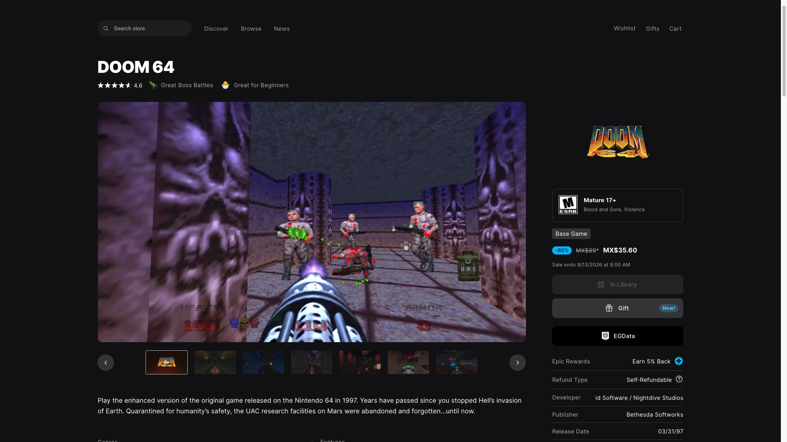
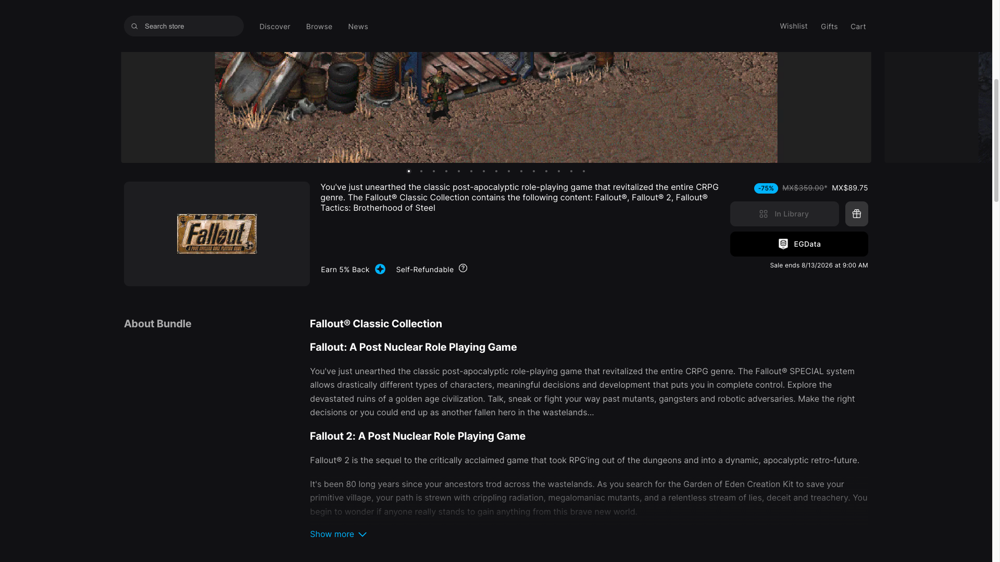
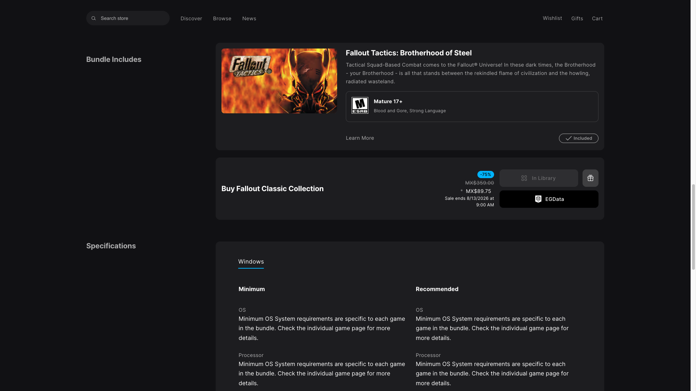
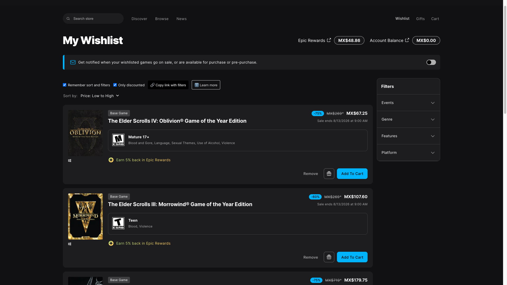

# Epic Games Store to EGData Button

Tampermonkey userscript for the Epic Games Store: an EGData button on product and bundle pages plus wishlist tools. / Userscript de Tampermonkey para Epic Games Store: botón a EGData en las páginas de producto y bundle, y herramientas en la lista de deseos.

*Product page (`/p/`): the EGData button sits under the purchase button and reuses Epic's own styling. / Página de producto (`/p/`): el botón de EGData va bajo el de compra y reutiliza el estilo propio de Epic.*

*Bundles (`/bundles/`) have two purchase buttons — the bar at the top and the "Buy …" section further down — and each one gets its own EGData button, so you never have to scroll back up. / Los bundles (`/bundles/`) tienen dos botones de compra —la barra de arriba y la sección "Buy …" más abajo— y cada uno recibe su propio botón de EGData, así no hay que volver a subir.*

*Wishlist (`/wishlist`): the toolbar the script inserts above Epic's sort control, with the two toggles, the copy-link button and "Learn more". / Lista de deseos (`/wishlist`): la barra que el script inserta sobre el control de orden de Epic, con los dos interruptores, el botón de copiar enlace y "Saber más".*

## English

### What it does

**EGData button**
- On **product** (`/p/`) and **bundle** (`/bundles/`) pages it adds a button to **[EGData](https://egdata.app/)**, a price and deal-history database, right below the purchase button.
- It links to **that exact offer**, not to a search. Epic identifies each offer with an internal id; on bundles that id only travels in a request the page makes after loading, so the script reads the URL of the store's own requests to catch it.
- The button borrows Epic's own button classes, so it matches the store instead of looking bolted on.
- **One button per purchase button.** Bundles show two and both get theirs.
- Navigating inside the store to a product or bundle **reloads the page**. Epic is a single-page app and the script was not active on the home, search or browse view; the reload is what guarantees the button appears.

**Wishlist (`/wishlist`)**
- **Only discounted:** scrolls through your whole list — Epic loads it in batches as you scroll — to detect every game and hide the ones that are not on sale, keeping the sort order you picked in Epic. A discount is detected by the percentage badge or the struck-through original price. This toggle is remembered on its own, whether or not "Remember sort and filters" is on.
- **Remember sort and filters:** saves the sort order and the sidebar filters you pick in Epic and reapplies them every time you come back.
- **Copy link with filters:** builds a URL that reproduces your sort, your filters and the "only discounted" state when opened with the script installed — shareable and bookmarkable. If the browser blocks clipboard access, it shows the URL in a dialog so you can copy it by hand.
- **"Learn more"** button with the full explanation inside the page, and a tooltip on every control.

**Language:** automatic Spanish / English detection, following the language Epic serves the page in.

**Install:**
1. Install [Tampermonkey](https://www.tampermonkey.net/).
2. Open the installer: [epic-games-store-to-egdata.user.js](https://github.com/g31w0fw0rld/epic-games-store-to-egdata/raw/main/epic-games-store-to-egdata.user.js) (also on [GreasyFork](https://greasyfork.org/es-419/users/1590477-g31w) and [OpenUserJS](https://openuserjs.org/users/g31w0fw0rldgmail.com/scripts)).

**Site:** `store.epicgames.com`

## Español

### Qué hace

**Botón de EGData**
- En páginas de **producto** (`/p/`) y de **bundle** (`/bundles/`) añade un botón hacia **[EGData](https://egdata.app/)**, base de datos de precios e historial de ofertas, justo bajo el botón de compra.
- Enlaza a **esa oferta concreta**, no a una búsqueda. Epic identifica cada oferta con un id interno; en los bundles ese id solo viaja en una petición que la página hace después de cargar, así que el script lee la URL de las propias peticiones de la tienda para capturarlo.
- El botón toma prestadas las clases de los botones de Epic, así que combina con la tienda en vez de parecer añadido.
- **Un botón por cada botón de compra.** Los bundles muestran dos y ambos reciben el suyo.
- Navegar dentro de la tienda hacia un producto o un bundle **recarga la página**. Epic es una SPA y el script no estaba activo en el home, la búsqueda ni el browse; esa recarga es lo que garantiza que el botón aparezca.

**Lista de deseos (`/wishlist`)**
- **Solo con descuento:** baja por toda tu lista —Epic la carga por lotes al hacer scroll— para detectar todos los juegos y ocultar los que no están en oferta, respetando el orden que elijas en Epic. El descuento se detecta por el badge de porcentaje o por el precio original tachado. Este interruptor se recuerda por su cuenta, esté o no activo "Recordar orden y filtros".
- **Recordar orden y filtros:** guarda el orden y los filtros de la barra lateral que elijas en Epic y los reaplica cada vez que vuelvas.
- **Copiar enlace con filtros:** genera una URL que, al abrirla con el script instalado, reproduce tu orden, tus filtros y el estado de "solo con descuento" — se puede compartir y guardar en marcadores. Si el navegador bloquea el portapapeles, muestra la URL en un diálogo para copiarla a mano.
- Botón **"Saber más"** con la explicación completa dentro de la página, y un tooltip en cada control.

**Idioma:** detección automática español / inglés, siguiendo el idioma con el que Epic sirve la página.

**Instalación:**
1. Instala [Tampermonkey](https://www.tampermonkey.net/).
2. Abre el instalador: [epic-games-store-to-egdata.user.js](https://github.com/g31w0fw0rld/epic-games-store-to-egdata/raw/main/epic-games-store-to-egdata.user.js) (también en [GreasyFork](https://greasyfork.org/es-419/users/1590477-g31w) y [OpenUserJS](https://openuserjs.org/users/g31w0fw0rldgmail.com/scripts)).

**Sitio:** `store.epicgames.com`

## Privacy / Privacidad

**EN:** the script makes no requests to external servers: everything runs in your browser. It declares `@grant none`, so it has no access to the userscript manager's privileged APIs. It stores in `localStorage` on `store.epicgames.com` (key `egs2egd-wishlist-settings`) only your wishlist sort order, filters and the "only discounted" state. To detect in-page navigation and to catch the offer id on bundles it wraps the page's `fetch` and `XMLHttpRequest` and **only reads each request's URL**: it does not alter, store or forward the requests or their contents. The copy-link button writes to the clipboard only when you click it. Nothing is sent to third parties or to the author, and you only visit EGData if you click the button.

**ES:** el script no hace ninguna petición a servidores externos: todo se procesa en tu navegador. Declara `@grant none`, así que no tiene acceso a las APIs privilegiadas del gestor de userscripts. Guarda en `localStorage` de `store.epicgames.com` (clave `egs2egd-wishlist-settings`) solo el orden, los filtros y el estado de "solo con descuento" de tu lista de deseos. Para detectar la navegación interna y para capturar el id de oferta en los bundles envuelve el `fetch` y el `XMLHttpRequest` de la página y **solo lee la URL** de cada petición: no altera, guarda ni reenvía las peticiones ni su contenido. El botón de copiar enlace escribe en el portapapeles únicamente cuando haces clic. No se envía nada a terceros ni al autor, y solo visitas EGData si haces clic en el botón.

## Support / Apoyar

This is part of something I'm building to grow. If it helps you and you'd like to support it, you can tip me on **[Ko-fi](https://ko-fi.com/g31w0fw0rld)** —only if you want—; and if a cause needs it more than I do, help that one instead.

Esto es parte de algo que estoy construyendo para crecer. Si te sirve y quieres apoyar, puedes invitarme un café en **[Ko-fi](https://ko-fi.com/g31w0fw0rld)** —solo si quieres—; y si hay una causa que lo necesite más que yo, ayúdala a ella.

---
Author / Autor: **g31w0fw0rld** · License / Licencia: **MIT**
